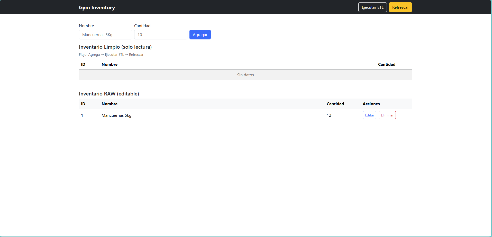
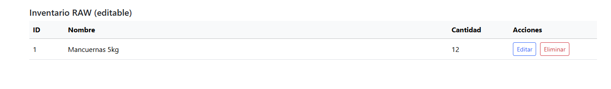
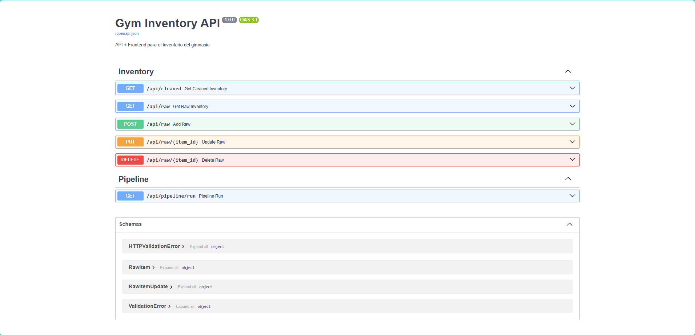
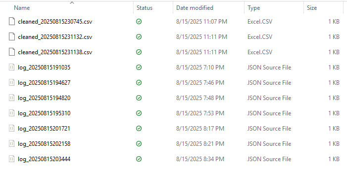

# Gym Inventory Project 🏋️‍♂️

Aplicación web para gestionar el inventario de un gimnasio con flujo **ETL** y una interfaz responsiva basada en **Bootstrap 5**.

- 📦 **Backend**: FastAPI (Python)  
- 🌐 **Frontend**: HTML + Bootstrap 5 (CSS + JS)  
- 🛢️ **Base de datos**: MySQL  
- ⚙️ **ETL Pipeline**: Script en Python que limpia y traspasa datos de `inventory_raw` → `inventory_cleaned`  
- 📁 **Backups**: CSV y logs JSON generados por el ETL  
- 🖥️ **Windows**: incluye `run.bat` y `run.ps1` para facilitar la ejecución  

---

## 🚀 Estructura del Proyecto

gym_inventory_project_improved/
│
├── backend/
│ ├── main.py # App FastAPI principal (sirve frontend y API)
│ ├── routes/
│ │ ├── inventory.py # Endpoints CRUD (RAW) + lectura CLEANED
│ │ └── pipeline.py # Endpoint para correr ETL
│ └── pipeline/
│ └── etl.py # Script ETL (Extract, Transform, Load)
│
├── frontend/
│ └── index.html # Interfaz web (Bootstrap 5, CRUD RAW + vista CLEANED)
│
├── sql/
│ └── schema.sql # Script para crear base de datos y tablas
│
├── backups/ # Carpeta donde se guardan respaldos del ETL
│
├── docs/
│ └── img/ # (Opcional) Capturas para el README
│
├── requirements.txt
├── .env # Variables de entorno (NO subir credenciales reales)
├── run.bat # Arranque rápido en Windows (inicia el backend)
└── run.ps1 # Arranque guiado en Windows (opcional: aplica schema)

---

2) Base de datos y tablas
Crea la base de datos y tablas ejecutando el script:

Opción A (MySQL Workbench): abre sql/schema.sql y ejecútalo.

Opción B (CLI de MySQL):

mysql -u root -p < sql/schema.sql
El proyecto no incluye datos de ejemplo: el inventario inicia vacío. Puedes agregar ítems desde la UI o la API.

3) Variables de entorno
Crea un archivo .env en la raíz del proyecto con tus valores reales:

DB_HOST=localhost
DB_USER=root
DB_PASSWORD=TU_PASSWORD
DB_NAME=gym_inventory
DB_PORT=3306

HOST=127.0.0.1
PORT=8000

4) Ejecutar (rápido)
Doble clic a run.bat
(crea/activa venv si hace falta, instala dependencias y levanta Uvicorn).

Abre: http://127.0.0.1:8000/

Alternativa: .\run.ps1 (PowerShell) con pasos guiados.

🧩 Uso rápido (flujo)
En la parte superior de la página, agrega ítems a RAW (Nombre + Cantidad) y pulsa Agregar.

Editar/Eliminar ítems en la tabla RAW (editable).

Pulsa Ejecutar ETL para limpiar y copiar a CLEANED.

Pulsa Refrescar para ver el inventario limpio actualizado.

Reglas de limpieza (ETL):

quantity < 0 → se corrige a 0

name → strip() + title() (capitalización por palabras)

Backups generados por el ETL (en backups/):

raw_YYYYMMDDHHMMSS.csv

cleaned_YYYYMMDDHHMMSS.csv

log_YYYYMMDDHHMMSS.json

🔌 Endpoints principales (API)
Método	Ruta	Descripción	Body (JSON) de ejemplo
GET	/api/raw	Lista inventario RAW	—
POST	/api/raw	Inserta en RAW	{"name":"mancuernas 5kg","quantity":12}
PUT	/api/raw/{id}	Actualiza nombre/cantidad en RAW	{"name":"Mancuernas 7kg"} ó {"quantity":15}
DELETE	/api/raw/{id}	Elimina ítem de RAW	—
GET	/api/cleaned	Lista inventario CLEANED (solo lectura)	—
GET	/api/pipeline/run	Ejecuta ETL (limpia y traspasa RAW→CLEANED)	—

Swagger UI: http://127.0.0.1:8000/docs

💡 Investigación de un segundo framework (Bootstrap vs Tailwind)
Bootstrap 5
En el proyecto se utilizó Bootstrap 5, un framework de CSS (con JavaScript opcional) orientado a construir interfaces web responsivas de manera ágil. Ofrece un sistema de grid de 12 columnas, componentes preconstruidos (como barras de navegación, tarjetas, botones y modales) y clases utilitarias para espaciado, colores y tipografía. Al no depender de jQuery, favorece implementaciones más ligeras y prácticas de accesibilidad, permitiendo un desarrollo rápido con una apariencia consistente desde el inicio.

Tailwind CSS
El framework investigado fue Tailwind CSS, un enfoque utility-first que proporciona clases utilitarias atómicas (por ejemplo, p-4, flex, bg-blue-500) para diseñar la interfaz directamente en el HTML. Es altamente configurable mediante un archivo de configuración y, en producción, elimina las clases no utilizadas, lo que produce un CSS final muy liviano. A diferencia de Bootstrap, no incluye componentes ni JavaScript; por ello, las interacciones deben implementarse con código propio o con librerías complementarias.

Comparativa entre ambos
La principal diferencia radica en el enfoque. Bootstrap 5 prioriza la rapidez inicial mediante componentes listos y patrones probados, lo que facilita entregar resultados sólidos en poco tiempo. Tailwind CSS privilegia la personalización total, ofreciendo control detallado del diseño y una identidad visual a medida. En términos de rendimiento, Tailwind suele generar paquetes de CSS más pequeños gracias a la purga de clases; Bootstrap, al incluir más estilos por defecto, tiende a ser más pesado. Respecto a la curva de aprendizaje, Bootstrap resulta más directo por sus componentes prediseñados, mientras que Tailwind exige pensar en utilidades y mantener orden en el marcado, aunque a cambio ofrece un sistema visual muy consistente. Finalmente, en funcionalidad, Bootstrap integra JavaScript para interacciones comunes; Tailwind no, por lo que requiere soluciones adicionales.

Referencias (formato APA):

Bootstrap. (s. f.). Introduction · Bootstrap v5.3. Bootstrap Documentation. Recuperado el 15 de agosto de 2025 de https://getbootstrap.com/docs/5.3/getting-started/introduction/

Bootstrap. (s. f.). JavaScript · Bootstrap v5.x. Bootstrap Documentation. Recuperado el 15 de agosto de 2025 de https://getbootstrap.com/docs/5.0/getting-started/javascript/

Bootstrap. (s. f.). Grid system · Bootstrap v5.0. Bootstrap Documentation. Recuperado el 15 de agosto de 2025 de https://getbootstrap.com/docs/5.0/layout/grid/

Hu, V. (2020, 8 de agosto). Bootstrap 5 Removes jQuery Dependency. InfoQ. https://www.infoq.com/news/2020/08/bootsrap-5-drops-jquery/

Tailwind CSS. (s. f.). Styling with utility classes — Core concepts. Tailwind CSS Documentation. Recuperado el 15 de agosto de 2025 de https://tailwindcss.com/docs/utility-first

Tailwind CSS. (s. f.). Optimizing for Production. Tailwind CSS Documentation. Recuperado el 15 de agosto de 2025 de https://tailwindcss.com/docs/optimizing-for-production

Contentful. (2024, 15 de agosto). Tailwind vs. Bootstrap: Comparing CSS frameworks. https://www.contentful.com/blog/tailwind-bootstrap-comparing-css-frameworks/

Strapi. (2025, 22 de enero). Bootstrap vs. Tailwind CSS: A comparison of top CSS frameworks. https://strapi.io/blog/bootstrap-vs-tailwind-css-a-comparison-of-top-css-frameworks

📸 Evidencias del Framework y la App
Ajusta las rutas a tu carpeta de capturas. Si usas Capturas/, deja los nombres como abajo.
(En GitHub, usa / (slash), no \ backslash.)

agregar al inventario

Inventario RAW (editable)

Modal de edición (Bootstrap Modal)

Ejecución del ETL y Cleaned actualizado

API documentada con Swagger

Backups generados por el ETL (CSV + JSON)

---
👩🏻‍💻 Autores
Proyecto creado por Luis Rojas, Mariana Lara y Manfred Leon para el curso de Programación Web (Entrega Grupal #5).